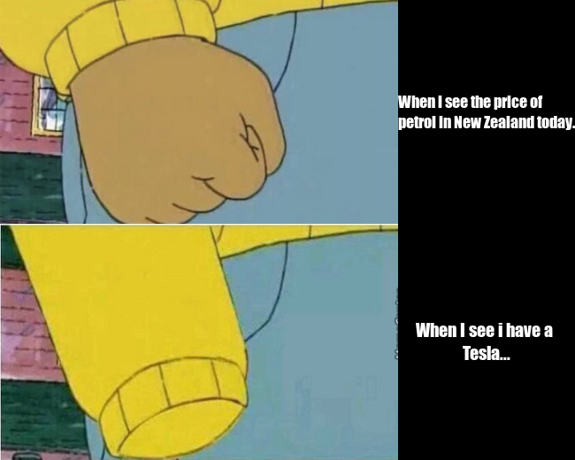

# Welcome to this page

## About me
I am a data science student at University of Auckland.

## Creating a meme
Here is the meme what i created.



## Background
Nowadays we can see the price of petrol is going 'crazy' in the whole world. We are angry about it, and we feel we spend much more on the car compared before.

However, look at someone who owns an electric car, for example, tesla. They feel happy and wise that they made the best decision ever. 'Crazy' thing disappear!

Therefore, I found two pictures of Arthur's fist; the top one implies anger, and the second suggests angry disappear. And I made them stack together with the word I created. 
## R code 
```r
library(magick)
# Top pic
img_angr <- image_read("https://wompampsupport.azureedge.net/fetchimage?siteId=7575&v=2&jpgQuality=100&width=700&url=https%3A%2F%2Fi.kym-cdn.com%2Fentries%2Ficons%2Fmobile%2F000%2F021%2F018%2Farthur.jpg")%>%
  image_scale(450)

word_pic <- image_blank(width = 200, height = 253, color="black") %>%
  image_annotate(text = "When i see the price of \npetrol in New Zealand today...", color="white", size = 18, font = "Impact", gravity = "west")

# bottom pic
img_release <- image_read("https://i.imgflip.com/1hcrp2.jpg")%>%
  image_scale(450)
img_release
word_pic2 <- image_blank(width = 200, height = 267,, color = "black") %>%
  image_annotate(text = "When I see i have a \nTesla...", color="white", size = 20, font = "Impact", gravity = "center")

# stack
first_row <- c(img_angr, word_pic) %>%
  image_append()
second_row <- c(img_release, word_pic2)%>%
  image_append()
pic_vector <- c(first_row, second_row)
pic_vector

meme <- image_append(pic_vector, stack = TRUE)
meme

# output
image_write(meme, "my_meme.png")

```
